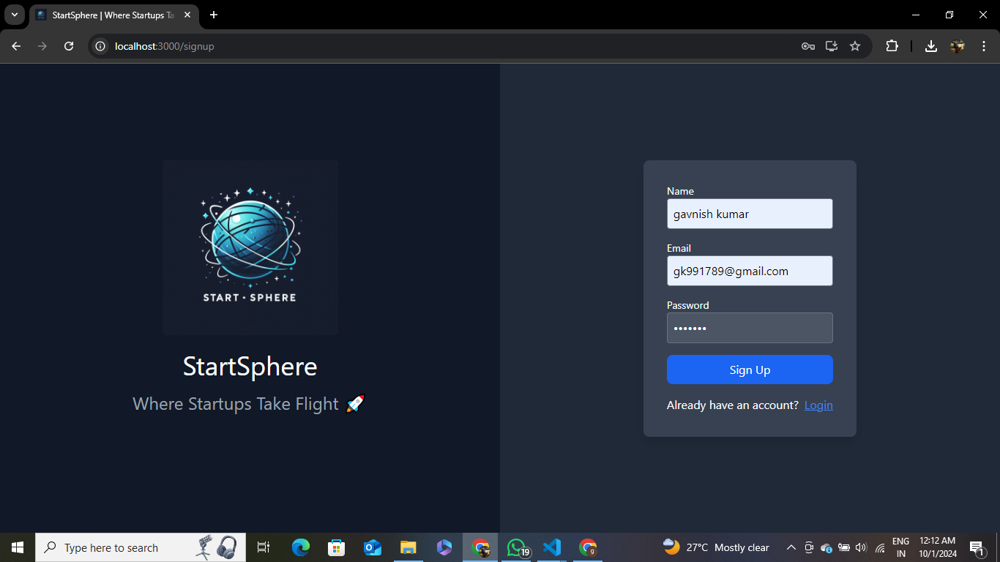
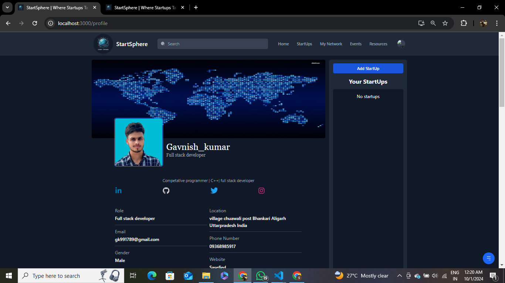
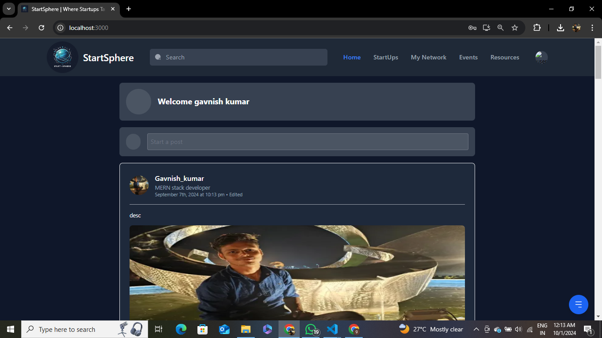
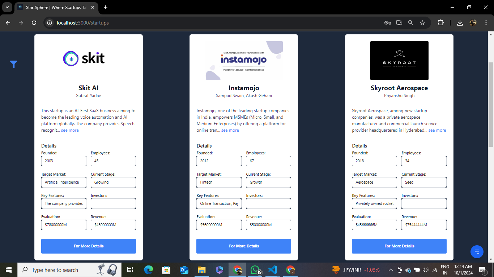
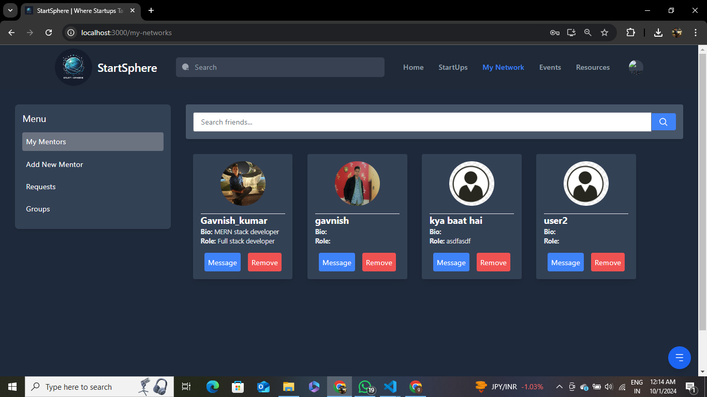
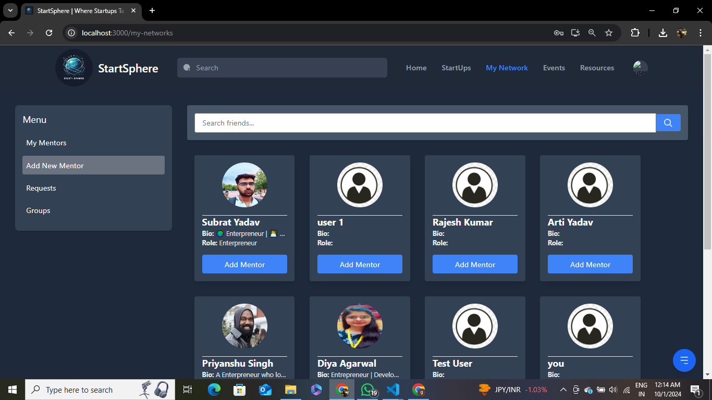
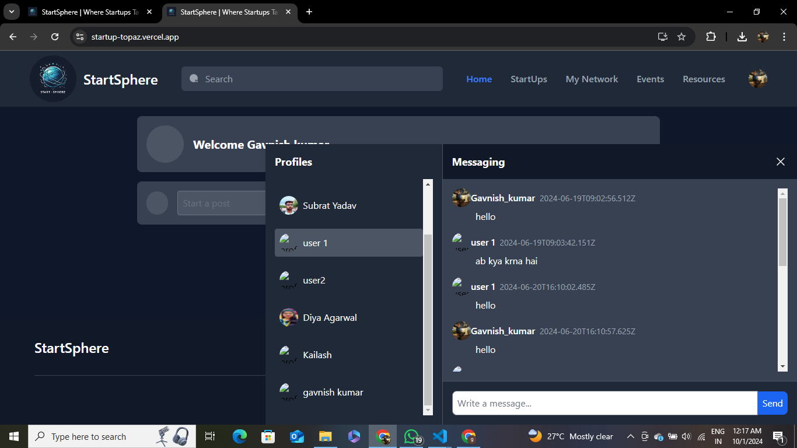
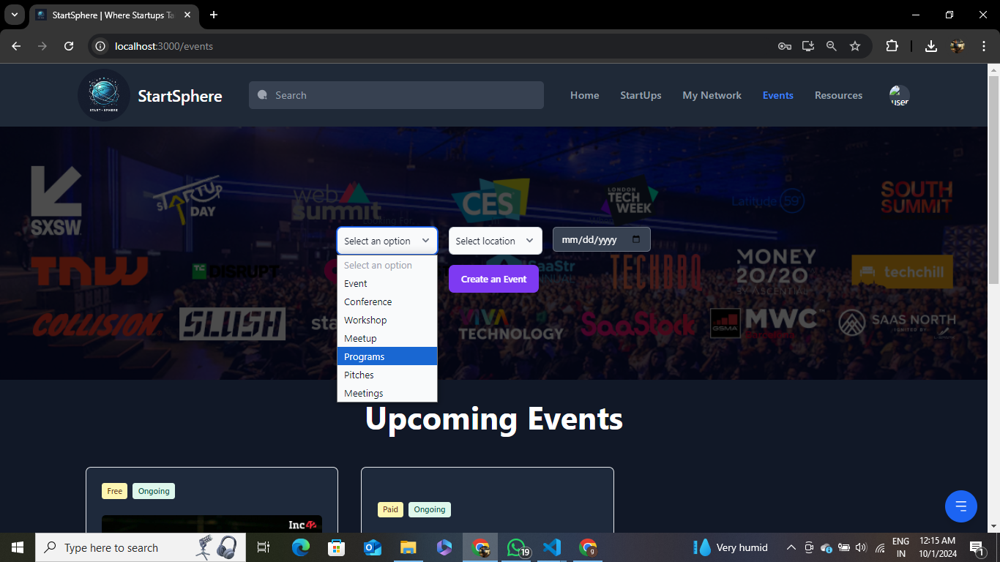
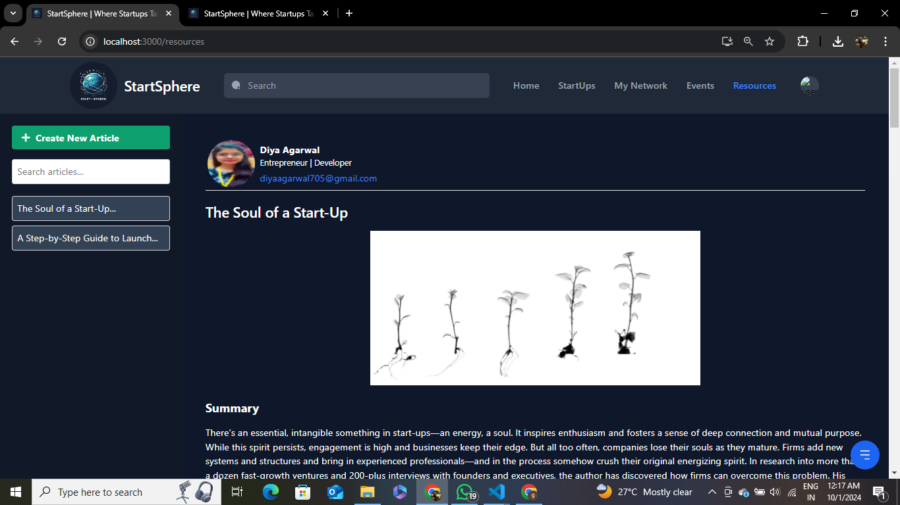
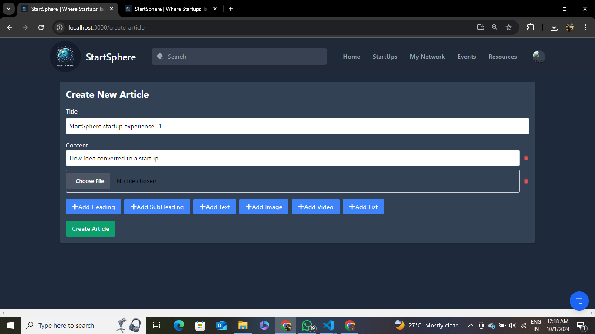

# **🌟 StartSphere: Your Startup Ecosystem Integrator**

A comprehensive platform designed to help emerging entrepreneurs navigate the startup ecosystem by providing essential resources, experienced mentorship, networking opportunities, and investor matchmaking. **StartSphere** simplifies the entrepreneurial journey and increases the chances of success for startups.

---

## 📋 **Table of Contents**
1. [🚀 Problem Statement](#-problem-statement)
2. [🎯 Objective](#-objective)
3. [✨ Key Features](#-key-features)
4. [🛠️ Technologies Used](#️-technologies-used)
5. [📊 Project Details](#-project-details)
6. [⚙️ Installation and Setup](#️-installation-and-setup)
7. [💡 Usage](#-usage)
8. [🖼️ Screenshots](#%EF%B8%8F-screenshots)
9. [📈 Impact Metrics](#-impact-metrics)
10. [🤝 Contributing](#-contributing)
11. [📜 License](#-license)
12. [📧 Contact](#-contact)

---

## 🚀 **Problem Statement**

Emerging entrepreneurs face several challenges in the startup ecosystem, such as:
- Limited access to reliable resources.
- Lack of experienced mentors.
- Fewer networking opportunities.
- Difficulty in securing funding.
- Intense competition.

These challenges make it harder to make informed decisions and build sustainable businesses.

---

## 🎯 **Objective**

The **StartSphere** platform aims to provide a **centralized digital hub** that connects aspiring entrepreneurs with mentors, investors, and essential resources. Its mission is to:
- Facilitate networking.
- Provide insights and guidance for startup management.
- Automate investor matchmaking.
- Foster a supportive environment for entrepreneurial success.

---

## ✨ **Key Features**

1. **🎨 User-Centric Design** – Easy-to-use interface for entrepreneurs, mentors, and investors.
2. **📈 Scalability** – Built to expand with user demand and accommodate new features.
3. **🔒 Security** – Ensures data protection and user privacy.
4. **📚 Access to Resources** – Digital library with articles, guides, and tools for startups at different stages.
5. **🧑‍🏫 Mentorship and Guidance** – Personalized mentor matching based on industry and expertise.
6. **🌐 Networking Opportunities** – Discussion forums, event calendars, and real-time chat.
7. **💰 Funding and Investment** – Automated investor matchmaking to simplify the funding process.
8. **🏆 High Competition Support** – Strategic resources and networking for startups to stand out.

---

## 🛠️ **Technologies Used**

- **Frontend:** ReactJS
- **Backend:** Node.js, Express
- **Database:** PostgreSQL, MongoDB (for real-time data management)
- **Containerization:** Docker
- **Deployment:** Azure Cloud
- **Machine Learning:** NLP-based cosine similarity algorithm for profile and investor matching
- **Real-Time Communication:** Socket.io for live chatting

---

## 📊 **Project Details**

### **Methodology and Principles**
- **🔄 Scalable and Modular Design:** Ensures the platform can handle increasing loads and easily integrate new features.
- **🔐 Security and Privacy:** Focus on protecting user data.
- **🛠 Comprehensive Features:** Integrates resources, mentorship, networking, and funding in one system.

### **Scope of the Solution**
**StartSphere** helps entrepreneurs:
- Centralize resources.
- Build meaningful mentor-mentee relationships.
- Enhance networking opportunities.
- Streamline the investment process.
- Gain competitive advantages in the market.

---

## ⚙️ **Installation and Setup**

### **Clone the Repository:**

```bash
git clone https://github.com/yourusername/startsphere.git
cd startsphere
```

### **Install Dependencies:**

**Backend Setup:**

```bash
cd backend
npm install
```

**Frontend Setup:**

```bash
cd frontend
npm install
```

### **Environment Variables Setup:**

Create a `.env` file in the backend directory and configure the following variables:

```bash
PORT=5000
MONGO_URI=<your_mongodb_connection_string>
JWT_SECRET=<your_jwt_secret>
```

### **Run the Application:**

**Backend:**

```bash
npm start
```

**Frontend:**

```bash
npm start
```

---

## 💡 **Usage**

1. **🔐 User Authentication:** Sign up or log in.
2. **👤 Profile Setup:** Create or update your profile and startup information.
3. **🏢 Explore Startups:** Use filters to browse and discover startup listings.
4. **🤝 Connect with Mentors & Friends:** Use personalized recommendations for networking.
5. **💬 Real-Time Chat:** Communicate with mentors and peers.
6. **🎫 Event Management:** Create and join startup-related events like webinars and seminars.
7. **📝 Article Sharing:** Share and explore startup-related articles.

---

## 🖼️ **Screenshots**

Here are some screenshots of the application to give you a visual overview:

1. **🔐 User Authentication (Sign Up / Log In Page)**  
   

2. **👤 User Profile (Create/Update Profile)**  
   

3. **📢 Feed with Posts, Comments, and Likes**  
   

4. **🏢 Startup Listings and Filters**  
     
   

5. **🤝 My Friend List and Friend Suggestions**  
     
   

6. **💬 Real-Time Chat**  
   

7. **🎫 Event Organizing Page**  
   

8. **📝 Article and Resource Sharing**  
     
   

---

## 📈 **Impact Metrics**

The platform measures success based on key performance indicators, including:
- **User Engagement:** Active users, session duration, and resource utilization.
- **Mentorship Success:** Number of mentor-mentee pairings and feedback.
- **Networking Activity:** Connections made, forum discussions, and event participation.
- **Funding Secured:** Amount raised through the platform and successful investor matches.
- **Startup Growth:** Metrics like revenue, user acquisition, and market expansion.

---

## 🤝 **Contributing**

We welcome contributions! Follow these steps to contribute:
1. **Fork the repository.**
2. **Create a new branch:** `git checkout -b feature-branch`
3. **Commit your changes:** `git commit -m 'Add new feature'`
4. **Push to the branch:** `git push origin feature-branch`
5. **Open a Pull Request.**

---

## 📜 **License**

This project is licensed under the MIT License. See the [LICENSE](./LICENSE) file for more details.

---

## 📧 **Contact**

For any questions or feedback, feel free to reach out.
